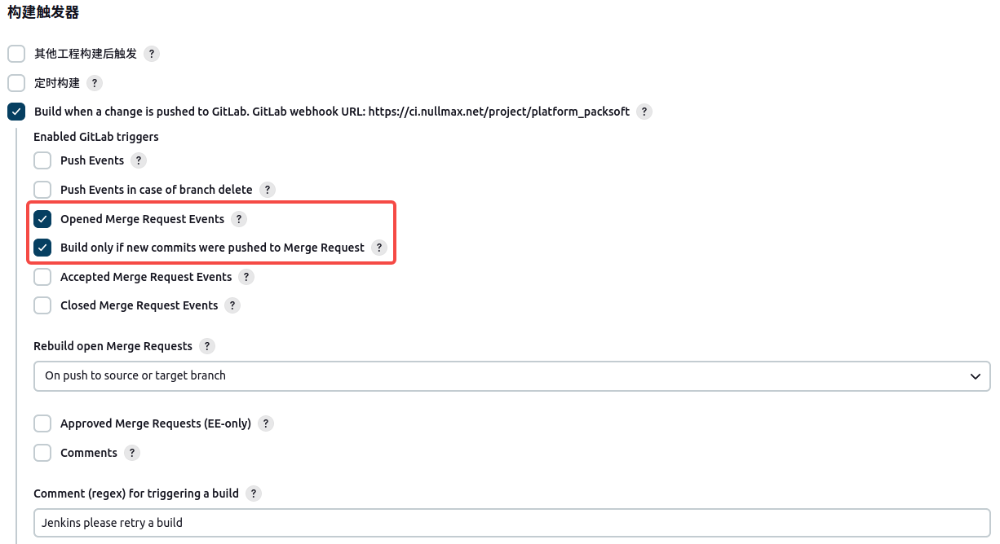
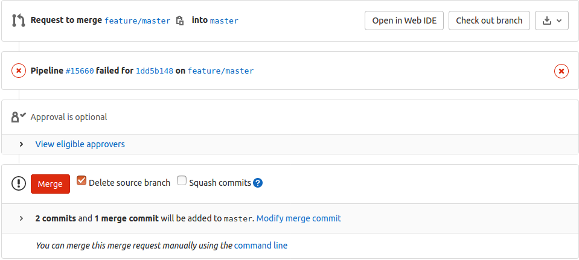
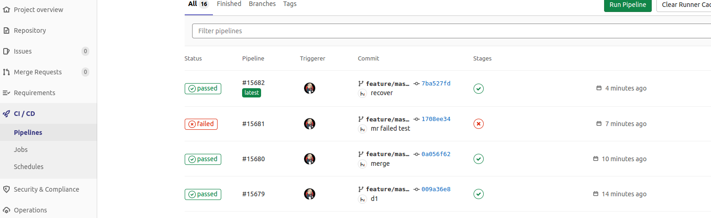

当对触发器进行这样的配置时，我们希望当仓库在做 Merge 提交或当这个 Merge 提交有更新时，都会触发流水线。这个并不难办。



但是有这样一种需求就是，当这个 Merge 提交或更新流水线失败时，我们希望 gitlab 页面的 `Merge` 按钮相比成功的时候有所不同，如下。

流水线成功时的状态:


流水线失败时的状态:



如果想要达到上面的效果，可以这样。

当流水线成功时，在执行的最后添加如下的代码:
```s
  updateGitlabCommitStatus name: 'pipeline-status', state: 'success'
```

当流水线失败时，在执行的最后添加如下的代码:
```s
  updateGitlabCommitStatus name: 'pipeline-status', state: 'failed'
```

如果我们为流水线上的每个 stage 都执行一次这样的调用，像下面这样:
```s
  updateGitlabCommitStatus name: ${env.STAGE_NAME}, state: 'success'
```
就可以在 gitlab 页面上得到完整的流水线:

