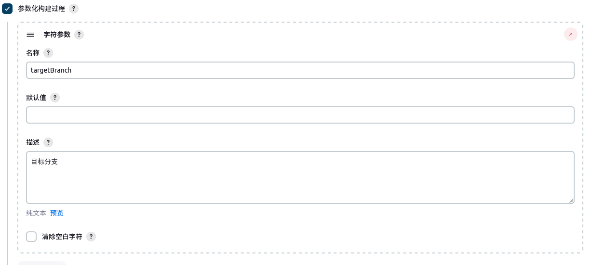

这里记录一种远程构建方法，普通用户权限即可。

### 背景

想要使用 curl 的方式来实现远程构建，但是利用这种方式在进行远程构建时，会丢失一些 Jenkins 环境变量，例如 gitlabBranch、gitlabSourceBranch、gitlabTargetBranch 等。这些环境变量在执行流水线进会用到，所以需要想办法来给予。

一个思路是通过 curl 命令 POST 方法将这些参数传入，但几经尝试均无法达到预期效果。

最后通过 curl + `参数化构建` 才达到了相对满意的效果。这里进行简单记录。


### 配置

进入 job 的配置页面，点选 `参数化构建过程`:


点击 `添加参数`，会弹出一个下拉列表项，这里选择 `字符参数` 选项即可:


在这里我们可以将无法通过 curl 传入，但同时需要在流水线中使用的变量在这里进行定义，比如 targetBranch。填写后保存即可:



> 注意，因为我们这里定义的是字符参数，所以当默认值为空是表示字符串为空。所以如果在默认值那里填写 `""` 时它就不为空了。

当然，可以根据需要添加不止一个参数:


保存后，可以在当前 job 页面的左侧看到多了一个 `Build with Parameters` 一项，点击可以看到所有已经设置的参数:


### 测试

然后像下面这样执行 curl(说明: 将 user、token、job_name 替换成自己的):
```s
  curl -X POST -u {user}:{token} https://ci.jenkins.net/job/{job_name}/buildWithParameters -d "targetBranch=master"
```

然后查看这条流水线的环境变量(执行 printenv 打印)，确实有预期的变量输出:


这里提供了一个[脚本](scripts/jenkins_trigger.sh)实现触发。为了达到触发指定的分支，另外还要在对应的 job 上进行如下配置:


