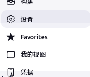
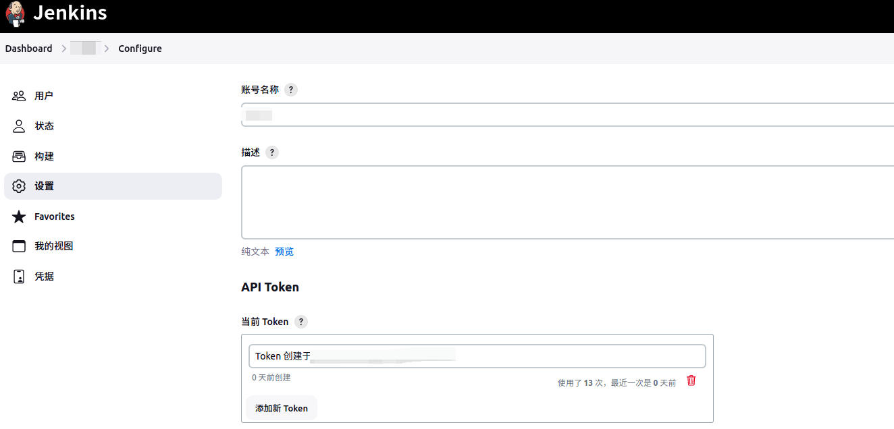

参考文档
- [Authenticating scripted clients](https://www.jenkins.io/doc/book/system-administration/authenticating-scripted-clients/)
- [API reference](https://python-jenkins.readthedocs.io/en/latest/api.html)

### 创建 API token

脚本客户端不推荐使用 `用户名+密码` 形式访问，而是更推荐使用 `用户名+API token` 形式访问。

API token 的申请方式是，打开 Jenkins 服务主页面，右上角找到自己的登录用户名，下拉找到 `Configure` 或 `设置`:



然后点击进入如下页面:



在上面的页面中，我已经创建了一个 api token。不过初次创建的页面展示也是大同小异。

### 命令行访问

命令行形式如下:
```s
  wget --auth-no-challenge --user=user --password=apiToken http://jenkins.example.com/job/your_job/build
```
示例如下:
```s
  wget --auth-no-challenge --user=vlt --password=e3f1e79e0c9f5be02bd5c8171161b76fd6 https://ci.jenkins.net/job/3rdparty/14
```

### 脚本访问

使用 python 脚本访问时，需要安装如下组件(笔者环境 python 版本为 "Python 3.10.9"):
```s
  pip3 install python-jenkins
```
