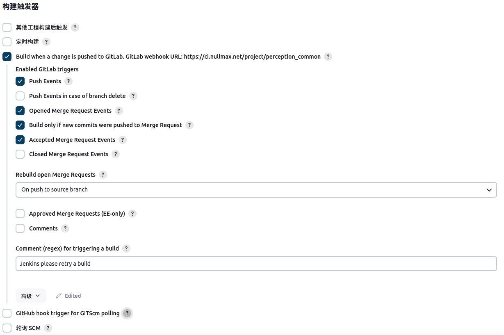
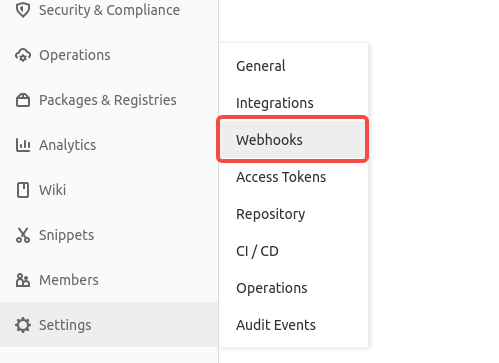
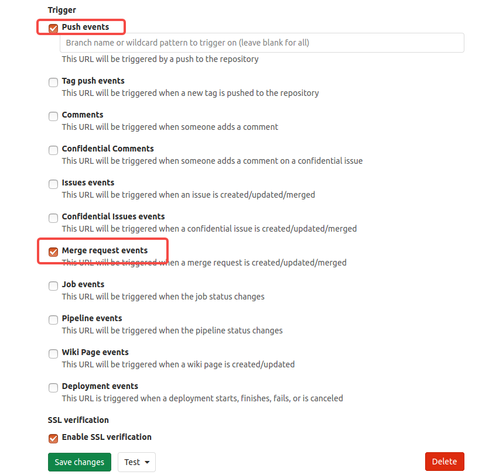
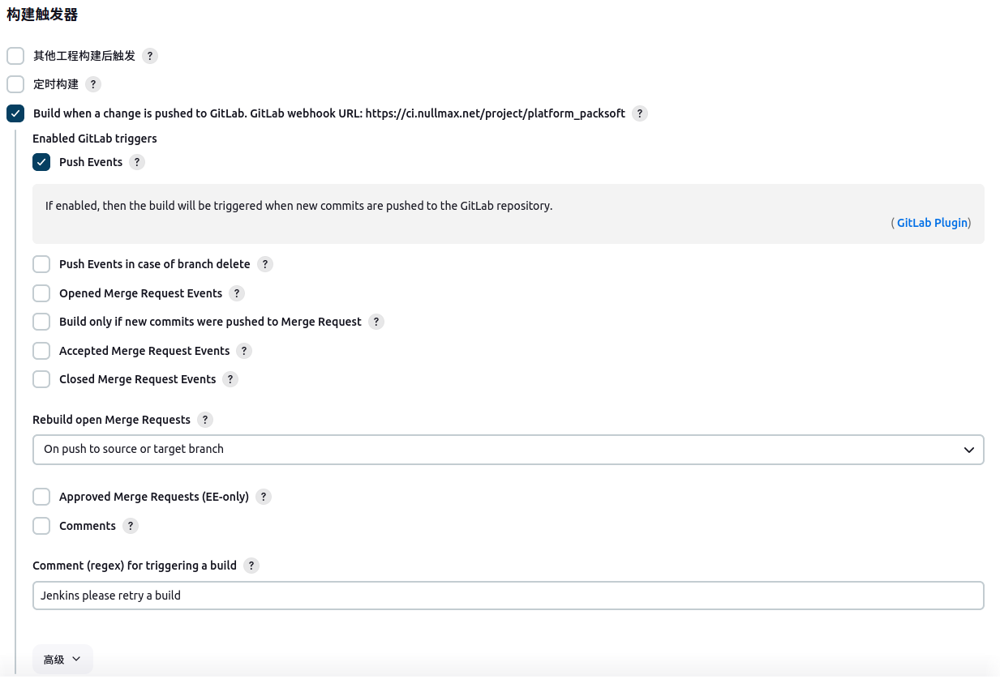
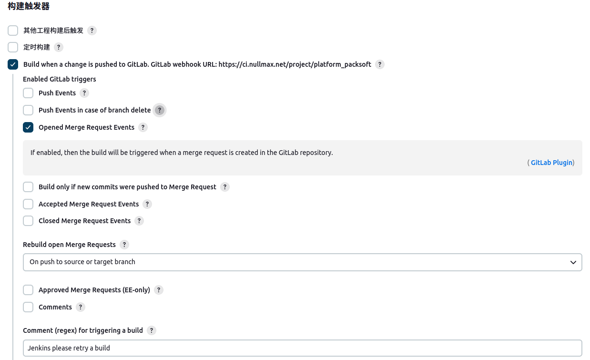
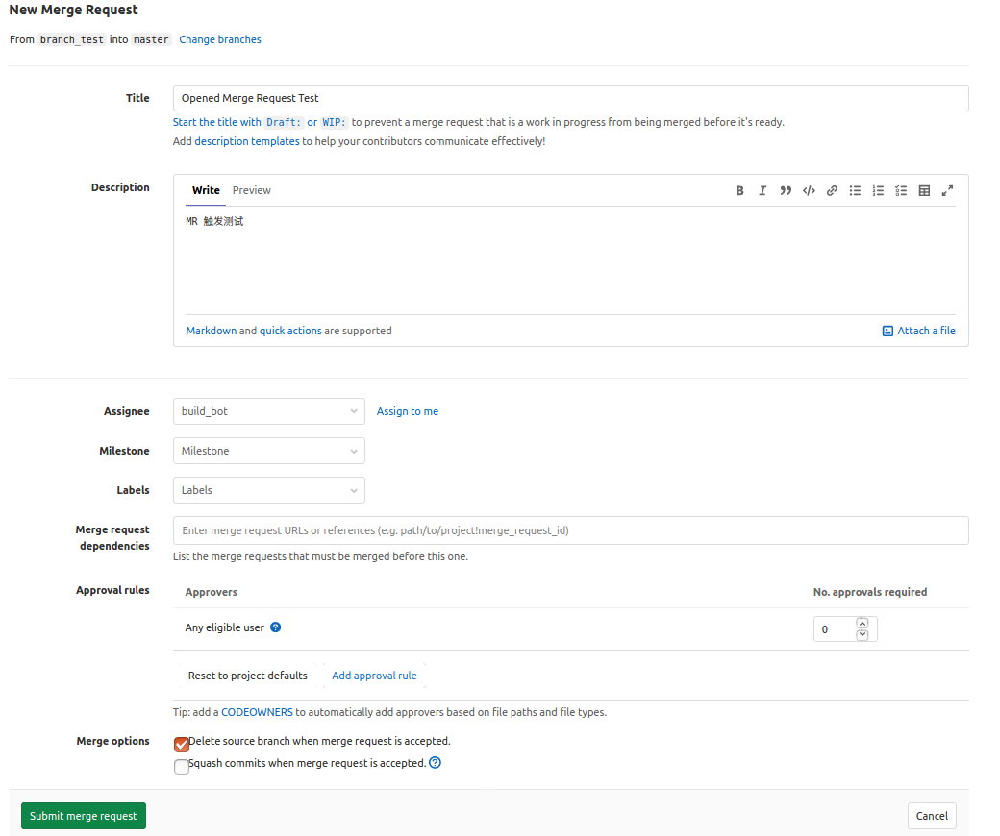
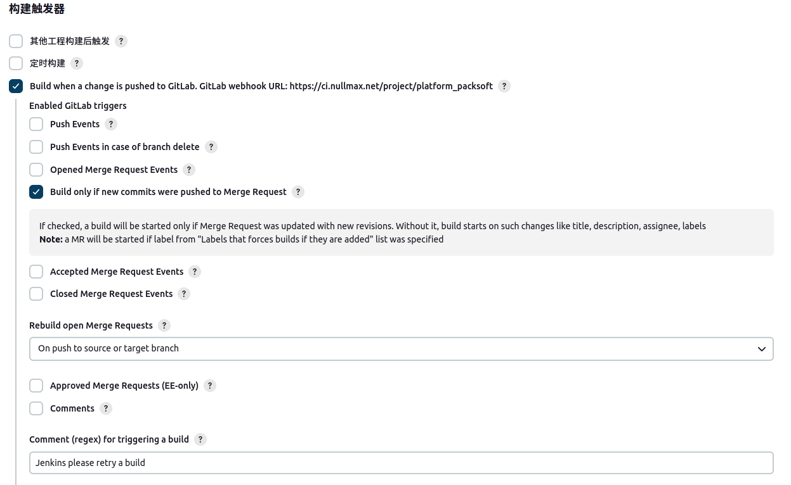
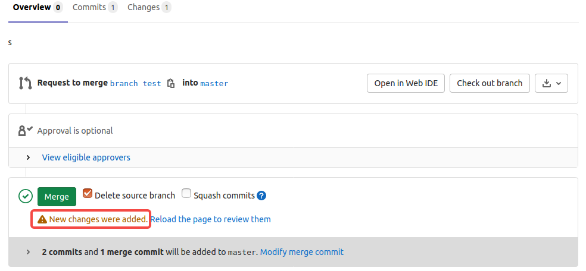
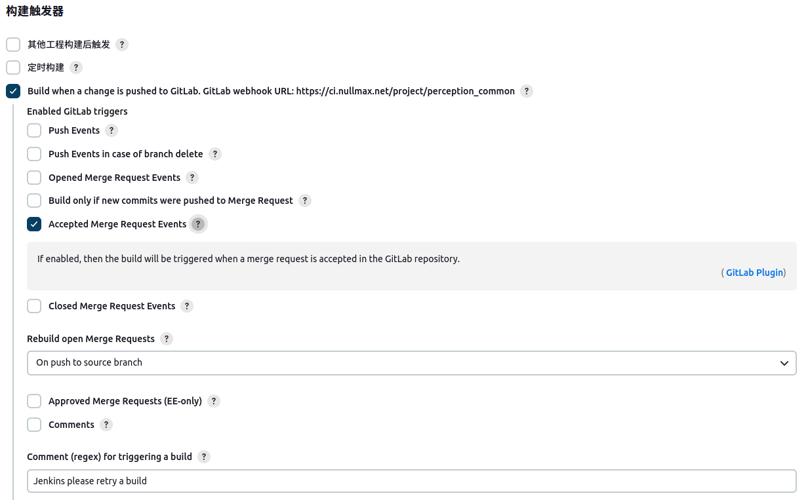
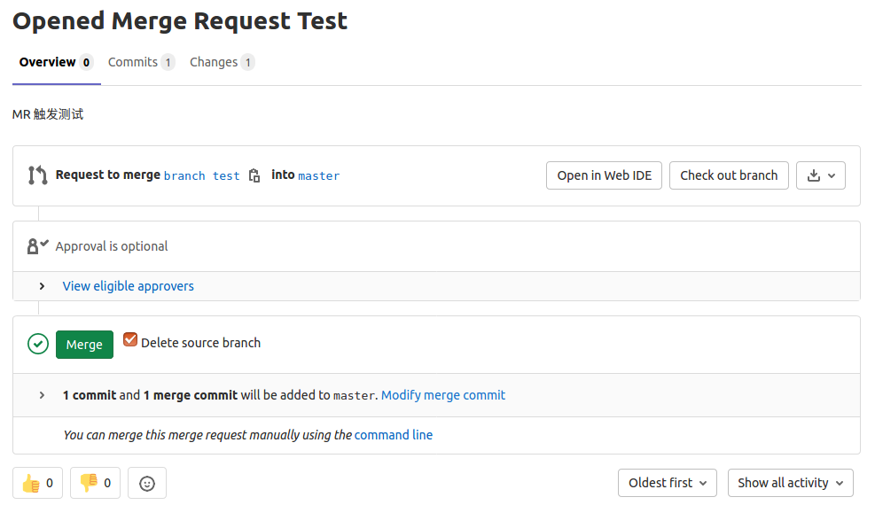

参考:
- [Jenkins 构建项目流程](https://blog.csdn.net/qq_42157883/article/details/123975199)

在 Jenkinsfile 文件中执行 `printenv` 会打印一串环境变量，这些变量可以通过 `env.???` 的方式进行访问。比较常用的:

- `BUILD_URL`: 形如 "https://ci.jenkins.net/job/platform_packsoft/31/"
- `gitlabSourceRepoHttpUrl`: 形如 "https://git.gitlab.net/gitlab-dev/platform/packsoft.git"
- `gitlabUserUsername`: 执行这次操作的 Jenkins 用户(非中文)
- `gitlabUserName`: 执行这次操作的 Jenkins 用户(中文)
- `gitlabSourceRepoSshUrl`: 形如 "git@git.gitlab.net:gitlab-dev/platform/packsoft.git"
- `JOB_BASE_NAME`: 形如 "platform_packsoft"
- `BUILD_ID`: 形如 "31"，就是 jobid
- `BUILD_NUMBER`: 和 BUILD_ID 一致
- `BUILD_TAG`: 形如 "jenkins-platform_packsoft-31"
- `JOB_URL`: 形如 "https://ci.jenkins.net/job/platform_packsoft/"
- `JOB_NAME`: 形如 "platform_packsoft"

另外，在不同的 stage 下，也会有局部变量如 `STAGE_NAME` 供使用。

Jenkins 可以构建多种触发器，如下:



根据触发器类型的不同，有些环境变量的表现也会不同。这里简单记录一些常见触发器的用法。

### 前期准备

安装插件: 插件已安装好，可以直接使用。若无可参考[这里](https://blog.csdn.net/weixin_46557083/article/details/124164638)。

gitlab 也需要进行一点设置，如下:



点击 Webhooks 选项进入如下页面，点选其中的两个选项，保存修改即可。



### Push Events



启用该触发器后，一旦有新的提交，构建就会被触发。

例如当前仓库位于 "branch_test" 分支上，最新的几个 commit 如下:
```s
commit 4cd2140e18c06b02a4bacf1ee1badd404e308ae5
Author: mine
Date:   Fri Nov 8 15:22:06 2024 +0800
commit ea32ba58e5baafd96db01f575f2d1a4e41d6e2a3
Author: build_bot
Date:   Fri Sep 20 15:31:52 2024 +0800
commit d121a8ffdf19e3a3dea02d93c4b52485ee730ffa
Author: mine
Date:   Fri Sep 20 11:41:21 2024 +0800
```
这时一些环境变量的值如下:
- `gitlabAfter`: 4cd2140e18c06b02a4bacf1ee1badd404e308ae5
- `gitlabMergeRequestLastCommit`: 4cd2140e18c06b02a4bacf1ee1badd404e308ae5
- `gitlabBefore`: ea32ba58e5baafd96db01f575f2d1a4e41d6e2a3
- `gitlabActionType`: PUSH
- `gitlabTargetBranch`: branch_test
- `gitlabBranch`: branch_test
- `gitlabSourceBranch`: branch_test

### Opened Merge Request Events



启用该触发器后，一旦有 MR 创建，构建就会被触发。

例如当前仓库位于 "branch_test" 分支上，最新的几个 commit 如下:
```s
commit 4cd2140e18c06b02a4bacf1ee1badd404e308ae5
Author: mine
Date:   Fri Nov 8 15:22:06 2024 +0800

commit ea32ba58e5baafd96db01f575f2d1a4e41d6e2a3
Author: build_bot
Date:   Fri Sep 20 15:31:52 2024 +0800

commit d121a8ffdf19e3a3dea02d93c4b52485ee730ffa
Author: mine
Date:   Fri Sep 20 11:41:21 2024 +0800
```
这个 branch_test 已经被提交到 gitlab 仓库，现在要创建一个 MR 将这个分支合并到 "master" 分支上，"master" 分支当前最新的 commit 如下:
```s
commit ea32ba58e5baafd96db01f575f2d1a4e41d6e2a3
Author: build_bot
Date:   Fri Sep 20 15:31:52 2024 +0800

commit d121a8ffdf19e3a3dea02d93c4b52485ee730ffa
Author: mine
Date:   Fri Sep 20 11:41:21 2024 +0800
```

创建一个 MR 页面，如下:



点击 `Submit merge request` 按钮，构建就会被触发。

这时一些环境变量的值如下:
- `gitlabMergeRequestLastCommit`: 4cd2140e18c06b02a4bacf1ee1badd404e308ae5
- `gitlabActionType`: MERGE
- `gitlabTargetBranch`: master
- `gitlabBranch`: branch_test
- `gitlabSourceBranch`: branch_test
- `gitlabMergeRequestState`: opened

### Build only if new commits were pushed to Merge Request



启用该触发器后，一旦 MR 的源分支有更新，构建就会被触发。

例如，我们在本地 "branch_test" 增加了一次新的提交(0d9f61fd6066ad6832e458bd0fe9bfe7b541ecb5)，如下:
```s
commit 0d9f61fd6066ad6832e458bd0fe9bfe7b541ecb5
Author: mine
Date:   Fri Nov 8 17:24:39 2024 +0800

commit 4cd2140e18c06b02a4bacf1ee1badd404e308ae5
Author: mine
Date:   Fri Nov 8 15:22:06 2024 +0800

commit ea32ba58e5baafd96db01f575f2d1a4e41d6e2a3
Author: build_bot
Date:   Fri Sep 20 15:31:52 2024 +0800
```

然后将本地的代码 push 到远端，这个时候 MR 页面会有更新提示:



而 Jenkins 构建也会触发。

这时一些环境变量的值如下:
- `gitlabMergeRequestLastCommit`: 0d9f61fd6066ad6832e458bd0fe9bfe7b541ecb5
- `gitlabActionType`: MERGE
- `gitlabTargetBranch`: master
- `gitlabBranch`: branch_test
- `gitlabSourceBranch`: branch_test
- `gitlabMergeRequestState`: opened

### Accepted Merge Request Events



启用该触发器后，当 MR 被合入时，构建就会被触发。

在上面的 `Opened Merge Request Events` 中，我们创建了一个 MR，如下:



现在点击 `Merge` 按钮合入，就会触发。

这时一些环境变量的值如下:
- `gitlabMergeRequestLastCommit`: 0d9f61fd6066ad6832e458bd0fe9bfe7b541ecb5
- `gitlabActionType`: MERGE
- `gitlabTargetBranch`: master
- `gitlabBranch`: branch_test
- `gitlabSourceBranch`: branch_test
- `gitlabMergeRequestState`: merged
